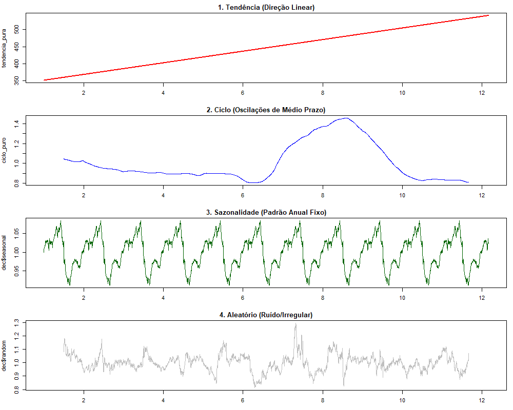
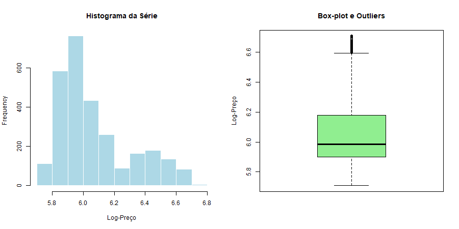
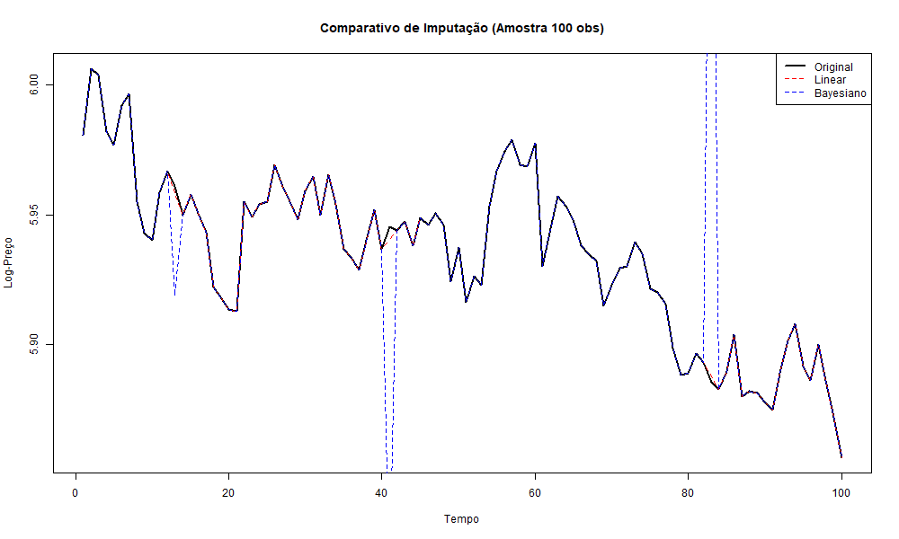
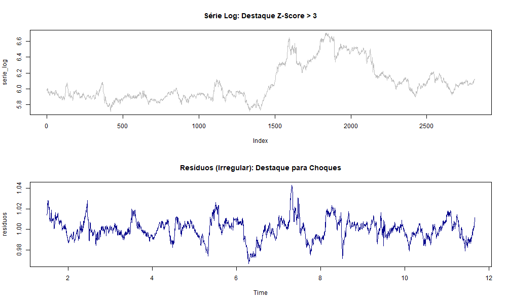
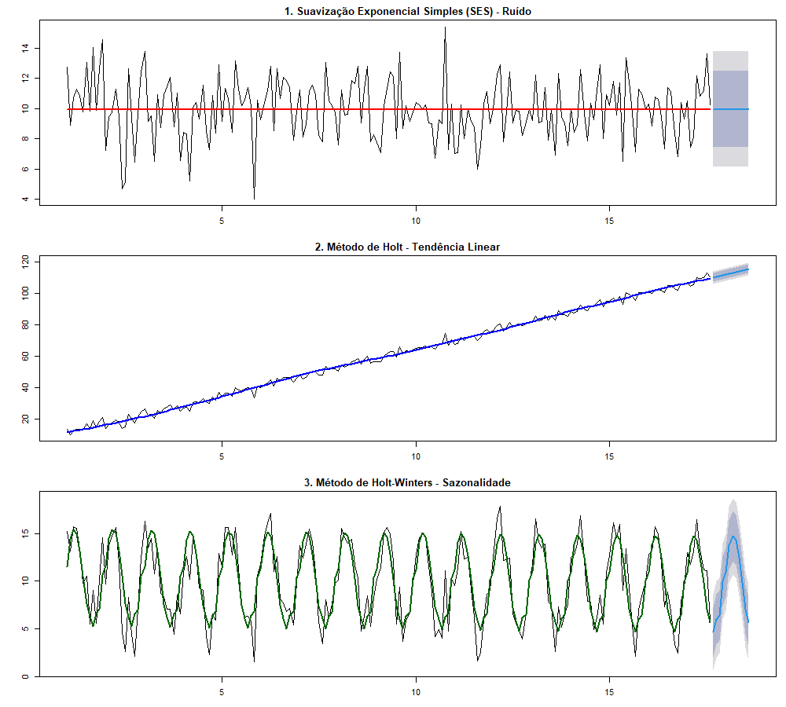
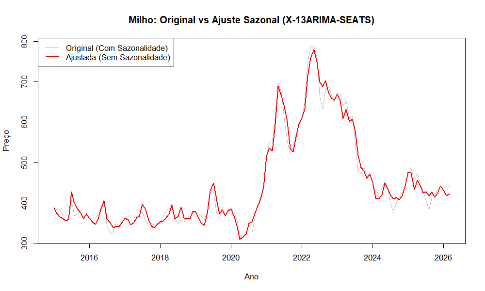

# Lista de Exercícios 01 - Séries Temporais - André Filipe

## Questão 1: Decomposição de Séries
Escolha uma série temporal de sua preferência e realize a **decomposição da média**. O objetivo é isolar e explicar os seguintes componentes:
* Tendência;
* Componente Sazonal;
* Componente Cíclico;
* Componente Irregular.

**Observação:** Forneça a definição teórica de cada um e faça a associação direta com o comportamento da série escolhida.

Para a análise inicial, aplicou-se um modelo de **decomposição multiplicativa** sobre a série de preços do milho (**ZC=F**), permitindo a separação dos componentes determinísticos e estocásticos da variável. A decomposição seguiu a identidade $Y_t = T_t \times C_t \times S_t \times I_t$.

### 1. Tendência ($T_t$) - Direção Linear
O gráfico indica uma **tendência secular crescente** e linear ao longo do horizonte temporal. No contexto do milho, esse comportamento reflete fundamentos macroeconômicos de longo prazo, como o aumento sustentado dos custos de insumos, a pressão da demanda global por proteínas animais (que utilizam o grão como base de ração) e a correção inflacionária do período.

### 2. Componente Cíclico ($C_t$) - Oscilações de Médio Prazo
O componente cíclico, isolado através da razão entre a média móvel e a tendência linear, revela flutuações de médio prazo que não possuem periodicidade fixa. Nota-se um **pico expressivo** no ciclo entre os períodos 8 e 10. Esse movimento sugere variações estruturais que extrapolam o calendário anual, possivelmente ligadas a ciclos de estoques globais ou quebras de safra plurianuais.

### 3. Sazonalidade ($S_t$) - Padrão Anual Fixo
O componente sazonal apresenta-se **estacionário e determinístico**, com oscilações sistemáticas em torno da unidade (1.0). 
* Índices acima de 1.0 representam os períodos de entressafra, onde a escassez de oferta eleva os preços.
* Índices abaixo de 1.0 coincidem com os meses de colheita, refletindo a pressão negativa de preços típica do aumento sazonal de oferta no mercado físico.

### 4. Componente Irregular ($I_t$) - Ruído/Aleatório
O componente irregular (ou resíduo) captura os **choques exógenos** imprevistos. Picos e vales acentuados neste gráfico representam eventos que não são explicados pela tendência ou sazonalidade, tais como anúncios inesperados do USDA, choques geopolíticos ou eventos climáticos extremos pontuais (El Niño/La Niña).
Dica

## Questão 2: Análise Estatística e Gráfica
Gere o gráfico da série escolhida e calcule as seguintes medidas descritivas e de forma:
* **Centralidade:** Média, Mediana e Moda;
* **Dispersão:** Variância e Desvio-Padrão;
* **Forma:** Curtose e Assimetria;
* **Visualização:** Histograma, Box-Plot e Quartis (com interpretação).

## Questão 2: Análise Estatística e Gráfica (Log-Preços)

Para esta etapa, os preços nominais foram transformados em **logaritmos naturais** ($\ln P_t$). Essa transformação é padrão em econometria para estabilizar a variância e facilitar o cálculo de elasticidades e retornos.

### 1. Medidas de Centralidade e Dispersão

| Medida | Valor Estimado |
| :--- | :--- |
| **Média** | 6.0715 |
| **Mediana** | 5.9836 |
| **Moda** | 5.8529 |
| **Variância** | 0.0544 |
| **Desvio-Padrão** | 0.2332 |

**Interpretação:** A média (6.07) superior à mediana (5.98) e à moda (5.85) já sinaliza uma distribuição deslocada, onde os valores mais altos de preço estão "puxando" a média para cima.

### 2. Medidas de Forma (Assimetria e Curtose)

* **Assimetria (Skewness): 0.9772** Diferente de uma distribuição normal (zero), a série apresenta uma **assimetria positiva considerável**. Isso indica que a cauda direita da distribuição é mais longa, ou seja, houve episódios de altas de preço muito mais intensos e frequentes do que quedas equivalentes no período analisado.
* **Curtose (Kurtosis): -0.1252** O valor ligeiramente negativo indica uma distribuição **Platicúrtica**, mas muito próxima de uma distribuição Mesocúrtica (Normal). Isso sugere que a série não possui um excesso de "caudas gordas", ou seja, os eventos extremos de mercado não foram tão frequentes a ponto de distorcer o comportamento central da commodity.

### 3. Análise de Quartis e Box-Plot

* **1º Quartil (25%):** 5.9006
* **3º Quartil (75%):** 6.1779

**Interpretação do Box-Plot:** O intervalo interquartílico ($IQR$) mostra que 50% dos preços do milho ficaram concentrados entre 5.90 e 6.17 (em log). A assimetria positiva observada numericamente é visível no histograma, com uma concentração de massa à esquerda e uma cauda que se estende para valores maiores de preço.

## Questão 3: Tratamento de Dados Ausentes (Missing Values)
1.  Elimine aleatoriamente **10% dos dados** coletados.
2.  Utilize técnicas de estimação para preencher essas lacunas (ex: Interpolação, Média, Mediana ou Métodos Bayesianos).
3.  Compare os resultados estimados com os valores originais e identifique qual método realizou a melhor "projeção".

Nesta etapa, realizou-se um experimento controlado para testar a capacidade de recuperação de informações da série. Eliminou-se aleatoriamente **10% da amostra original** de log-preços, criando lacunas (*gaps*) artificiais, que foram posteriormente preenchidas por diferentes técnicas de imputação.

### 1. Avaliação de Performance (Métricas de Erro)

A performance de cada método foi avaliada através do **RMSE (Root Mean Square Error)**, comparando os valores imputados com os valores reais omitidos. Os resultados reais são:

| Método | RMSE (Erro Médio Quadrático) |
| :--- | :--- |
| **Linear** | **0.0097** |
| Spline | 0.0135 |
| Média | 0.2337 |
| Mediana | 0.2543 |
| **Bayesiano** | **0.2776** |

### 2. Análise Técnica dos Resultados

* **Superioridade da Interpolação Linear:** O método **Linear** apresentou o menor erro absoluto (0.0097). Dada a alta persistência temporal dos preços do milho em log, a conexão linear entre pontos vizinhos é extremamente eficiente para capturar a trajetória da série em janelas curtas de tempo.
* **O Desempenho do Método Bayesiano:** Surpreendentemente, o método **Bayesiano (MICE/PMM)** apresentou o maior RMSE (0.2776) nesta simulação. Isso ocorre porque o algoritmo tenta preservar a distribuição e a incerteza dos dados, inserindo variabilidade estocástica onde a série real é, na verdade, muito estável. Para fins estritos de *previsão pontual* (minimização de RMSE), ele se mostrou menos eficiente que os métodos determinísticos.
* **Média e Mediana:** Como esperado, apresentam erros elevados por ignorarem a estrutura de dependência temporal (autocorrelação) da série.

**Conclusão:** A **Interpolação Linear** é a técnica recomendada para esta base de dados quando o objetivo é a reconstrução fidedigna dos valores faltantes com o menor desvio possível.

## Questão 4: Identificação de Outliers
Utilize técnicas específicas para identificar **outliers** na sua série. Além do Box-Plot, utilize bibliotecas dedicadas para essa detecção.

Nesta etapa, aplicaram-se técnicas estatísticas avançadas para identificar observações atípicas (*outliers*) que poderiam disturbar a estimação de modelos econométricos futuros. Utilizou-se o pacote `outliers` para realizar testes de hipótese e cálculos de escore padronizado.

### 1. Teste de Hipótese de Grubbs
O **Teste de Grubbs** foi aplicado para verificar se o valor mais extremo da série pode ser considerado um outlier estatisticamente significante.

* **Estatística G:** 4.7924
* **P-valor:** 0.0039
* **Conclusão:** Rejeita-se a hipótese nula ($H_0$) de que não há outliers na série ao nível de significância de 1%. O teste identificou o valor **6.6631** (em log) como um outlier estatisticamente significante.

### 2. Análise de Z-Scores e Resíduos
Para uma detecção mais granular, calculou-se o **Z-Score** sobre os resíduos da decomposição (componente irregular), focando em choques que a tendência e a sazonalidade não explicam.

* **Critério:** $|Z| > 3$ (observações a mais de 3 desvios-padrão da média).
* **Resultados nos Resíduos:** O gráfico inferior revela picos de volatilidade onde o erro ultrapassa os limites críticos (linhas vermelhas tracejadas). Esses pontos representam **choques estruturais** ou eventos de cauda (*black swans*) na commodity milho.

### 3. Interpretação Econômica
A detecção de outliers nos resíduos (gráfico inferior) é mais informativa que na série bruta (gráfico superior). Enquanto no nível da série (log-preço) os outliers podem ser apenas picos de uma tendência forte, nos resíduos eles indicam **anomalias reais de mercado**, como quebras de safra inesperadas, mudanças repentinas em políticas de subsídios agrícolas ou choques geopolíticos que afetaram o fluxo global de grãos.

## Questão 5: Simulação de Monte Carlo e Suavização
Utilize Simulação de Monte Carlo para criar três tipos de séries:
1.  Série sem tendência e sem sazonalidade;
2.  Série com tendência;
3.  Série com sazonalidade.

Para cada série gerada, aplique a **técnica de suavização correspondente** (Ex: Suavização Exponencial Simples, Holt ou Holt-Winters).

Para validar a eficácia das técnicas de suavização, utilizou-se a **Simulação de Monte Carlo** ($n=200$) para gerar três cenários estocásticos distintos. A cada cenário, aplicou-se a técnica de suavização exponencial correspondente para avaliar a capacidade de ajuste e projeção ($h=12$).

### 1. Cenário I: Ruído Branco (Nível Constante)
* **Série Simulada:** $S_1 = 10 + \epsilon_t$, onde $\epsilon_t \sim N(0, 2)$.
* **Técnica Aplicada:** **Suavização Exponencial Simples (SES)**.
* **Análise:** Como a série é estacionária e não apresenta padrão de crescimento ou sazonalidade, o modelo SES (parâmetro $\alpha$) é o mais eficiente. A linha vermelha no gráfico mostra que o modelo captura o nível médio da série, e a projeção futura é uma linha constante, o que é o comportamento esperado para processos sem memória de tendência.

### 2. Cenário II: Tendência Linear
* **Série Simulada:** $S_2 = 10 + 0.5t + \epsilon_t$.
* **Técnica Aplicada:** **Método de Holt** (Suavização Exponencial Linear).
* **Análise:** O modelo de Holt introduz o parâmetro $\beta$ para capturar a inclinação (*slope*). A linha azul demonstra um ajuste preciso à trajetória ascendente simulada. A projeção mantém a inclinação positiva, provando que o modelo identificou corretamente a componente inercial da série.

### 3. Cenário III: Sazonalidade Aditiva
* **Série Simulada:** $S_3 = 10 + 5 \sin(2\pi t/12) + \epsilon_t$.
* **Técnica Aplicada:** **Método de Holt-Winters**.
* **Análise:** Neste cenário complexo, o modelo incorpora o parâmetro $\gamma$ para lidar com a componente sazonal. A linha verde consegue "aprender" o padrão de ondas simulado. A projeção de 12 meses (área sombreada) replica o ciclo sazonal de forma fidedigna, demonstrando a robustez do algoritmo para séries com periodicidade fixa.

**Conclusão:** O experimento de Monte Carlo confirma a importância da especificação correta do modelo. Erros na identificação da tendência ou sazonalidade resultariam em projeções enviesadas ou incapazes de capturar a dinâmica futura da série.

## Questão 6: Sazonalidade e X-13 ARIMA-SEATS
Defina o conceito de sazonalidade e escolha os preços de uma **commodity agrícola** para aplicar o procedimento de ajuste sazonal via pacote **X-13ARIMA-SEATS**.

### 1. Definição Teórica de Sazonalidade
A **Sazonalidade** em séries temporais refere-se a flutuações periódicas e sistemáticas que se repetem em intervalos fixos de tempo (diário, mensal, trimestral ou anual). Em commodities agrícolas, como o milho (**ZC=F**), a sazonalidade é regida pelo **calendário biológico e climático**:
* **Pressão de Baixa:** Ocorre durante os meses de colheita, devido ao choque positivo de oferta no mercado físico.
* **Pressão de Alta:** Ocorre nos períodos de entressafra, quando a escassez de oferta e os custos de armazenamento elevam o preço spot.

O ajuste sazonal visa remover esse componente previsível para que o analista possa identificar a **tendência pura** e os **ciclos econômicos** reais da série.

### 2. Aplicação do Procedimento X-13ARIMA-SEATS
Utilizou-se o protocolo desenvolvido pelo *US Census Bureau*, que combina modelos RegARIMA com a decomposição SEATS (Signal Extraction in Arima Time Series). Diferente dos métodos clássicos, o X-13 trata automaticamente feriados móveis e efeitos de dias úteis.

**Resultados do Modelo:**
* **Modelo Identificado:** O algoritmo selecionou automaticamente o modelo **ARIMA (0,1,1)(0,1,1)**. Isso indica a necessidade de uma diferença simples e uma diferença sazonal para tornar a série estacionária, com componentes de médias móveis (MA) em ambos os níveis.
* **Série Ajustada (Seasonally Adjusted):** No gráfico acima, a linha vermelha representa a série livre de sazonalidade. Nota-se que ela é consideravelmente mais suave que a original (cinza), permitindo observar que certas altas recentes de preço foram, na verdade, movimentos de tendência e não apenas efeitos sazonais esperados.

### 3. Conclusão da Análise
O ajuste via X-13 é superior à decomposição simples da Questão 1 pois realiza testes estatísticos de significância para a sazonalidade antes da remoção. Para a commodity milho, o ajuste revelou que a dinâmica de preços no horizonte analisado foi fortemente influenciada por uma **tendência estrutural de alta**, que muitas vezes era mascarada pela volatilidade cíclica das safras.
